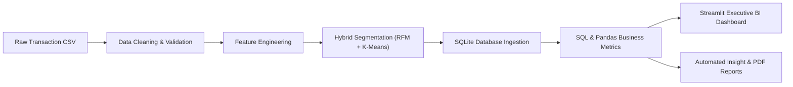
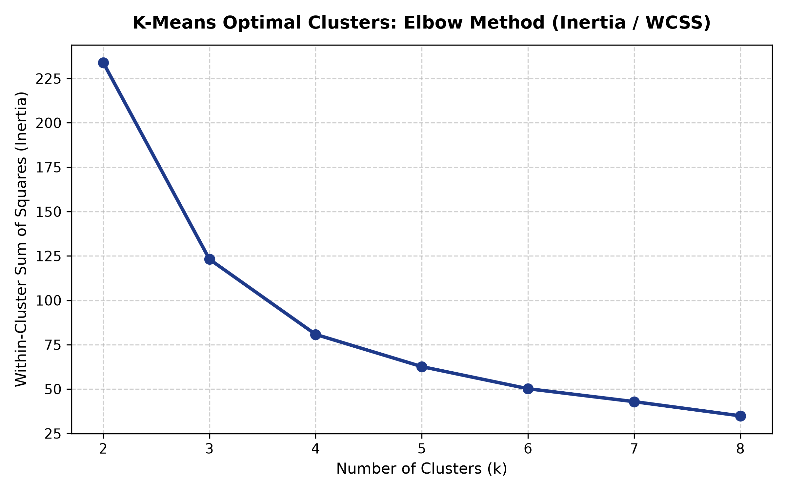
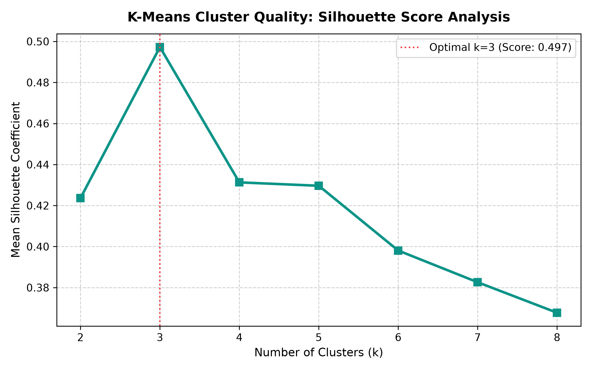
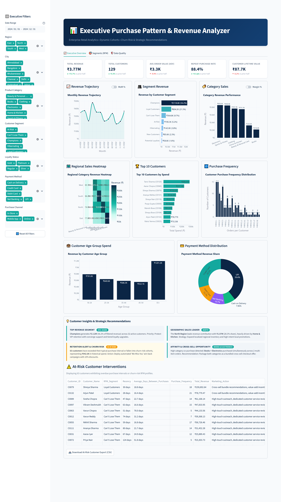
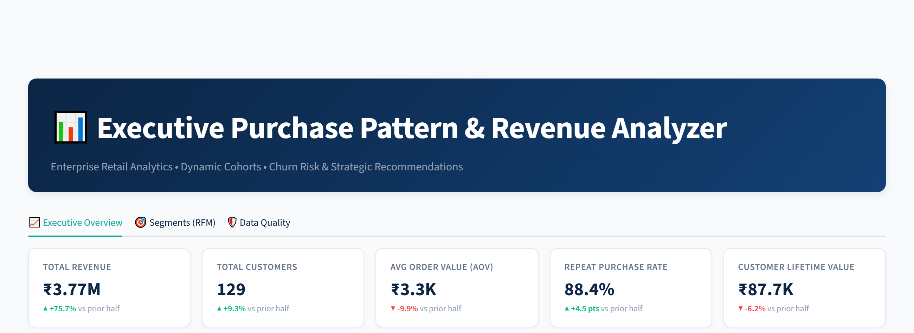
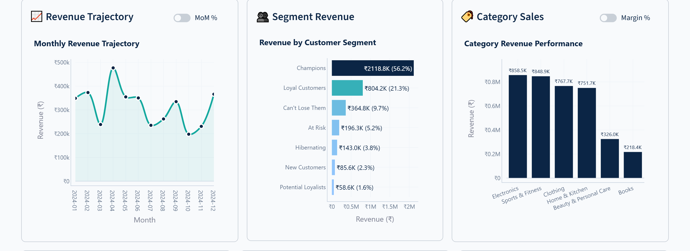
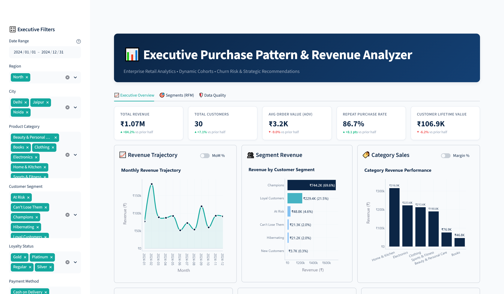
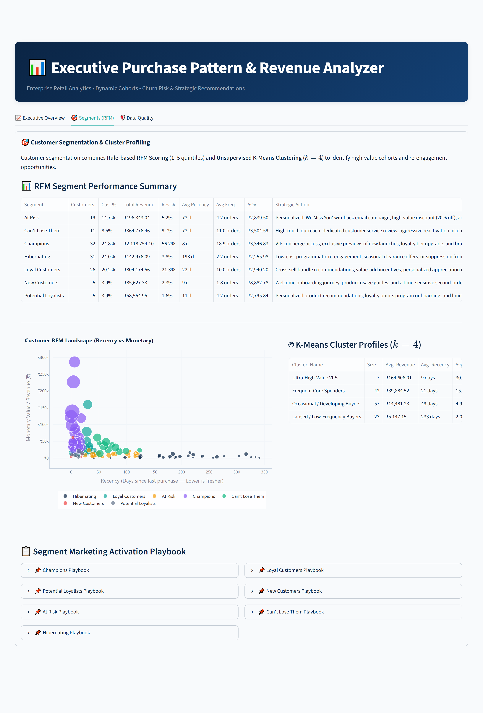

# 🛒 Customer Purchase Pattern Analyzer 
(https://customer-purchase-pattern-analyzer.streamlit.app/)

[](https://www.python.org/)
[](https://streamlit.io/)
[](https://www.sqlite.org/)
[](https://scikit-learn.org/)
[](https://plotly.com/)
[](tests/)
[](LICENSE)

An end-to-end, industry-grade customer analytics platform and executive business intelligence system designed to analyze retail customer purchasing patterns, calculate 360-degree customer equity metrics (CLV, AOV, Recency, Frequency), perform hybrid customer segmentation (Rule-based RFM Quintiles + Unsupervised K-Means Clustering), uncover market basket cross-selling affinities, and surface actionable churn-mitigation strategies through an interactive Streamlit BI dashboard.

---

## 📌 Executive Objective

The **Customer Purchase Pattern Analyzer** simulates the enterprise decision-support workflow of leading omnichannel and e-commerce retailers (such as Amazon, Flipkart, and BigBasket). By ingesting raw, multi-format transactional data, the system performs programmatic cleaning, calendar and financial feature engineering, statistical cohort segmentation, relational SQLite modeling, and automated insight generation. It equips leadership teams with real-time visibility into customer lifetime value, margin contribution, and seasonal demand swings—transforming disparate transaction logs into high-impact customer retention and merchandising strategies.

---

## 💼 Business Problem

Modern e-commerce and retail enterprises face critical operational and commercial hurdles:
1. **Severe Revenue Vulnerability**: Lack of visibility into customer revenue concentration leaves businesses blind to the risk of top-tier customer churn.
2. **Generic, Inefficient Marketing**: Blanket discounting depresses gross margins while failing to reactivate dormant buyers or incentivize high-potential repeat spenders.
3. **Margin Disconnect**: High top-line gross merchandise volume (GMV) often masks razor-thin category margins, leading marketing teams to over-subsidize low-margin hardware.
4. **Untapped Basket Affinities**: Siloed product categorization prevents retailers from deploying algorithmic checkout cross-sells to lift Average Order Value (AOV).
5. **Passive Churn Detection**: Retailers identify churned customers only after they have permanently left, rather than detecting when a repeat buyer's inter-purchase cycle has lapsed.

---

## 📊 Dataset Description

The dataset models omnichannel consumer retail transactions across India over a 12-month calendar window (2024), encompassing **1,160 clean transactions** across **129 unique customer cohorts**, **6 product categories**, **12 metro and tier-1 cities**, and multiple payment and fulfillment channels.

### Data Dictionary & Cleaning Treatment

| Column Name | Data Type | Description | Cleaning & Imputation Strategy |
| :--- | :--- | :--- | :--- |
| `Transaction_ID` | `VARCHAR(16)` | Unique invoice identifier | Deduplicated; integrity-verified |
| `Customer_ID` | `VARCHAR(16)` | Unique customer account identifier | Rows with null Customer ID dropped |
| `Customer_Name` | `VARCHAR(64)` | Full customer name | Whitespace stripped, collapsed, converted to Title Case |
| `Age` | `INTEGER` | Customer age in years (18–72) | Median imputation by demographic distribution |
| `Gender` | `VARCHAR(16)` | Customer gender (`Male`, `Female`, `Other`) | Statistical mode imputation |
| `City` | `VARCHAR(32)` | Customer transaction city | Standardized naming; tied to regional boundaries |
| `Region` | `VARCHAR(16)` | Geographic territory (`North`, `South`, `East`, `West`) | Deterministically harmonized from City |
| `Occupation` | `VARCHAR(32)` | Customer occupational persona | Mode / Category-matched imputation |
| `Product_Category`| `VARCHAR(32)` | Top-level merchandising department | Corrected via dictionary mapping + fuzzy string matching (`difflib`) |
| `Product_Name` | `VARCHAR(64)` | Item SKU description | Standardized catalog title |
| `Purchase_Date` | `DATE` | Transaction timestamp (ISO `YYYY-MM-DD`) | Parsed mixed formats (`DD/MM/YYYY`, `MM-DD-YYYY`, `YYYY.MM.DD`) |
| `Quantity` | `INTEGER` | Number of units purchased | Constrained $\ge 1$; non-positive records corrected |
| `Unit_Price` | `FLOAT` | Retail selling price per unit (₹) | Mathematically validated against Category median |
| `Discount_Used` | `FLOAT` | Promotional discount applied ($0.00 - 0.30$) | Missing assumed $0.0$; validated within range |
| `Total_Purchase_Value` | `FLOAT` | Net invoice value ($Qty \times Price \times (1 - Disc)$) | Mathematically recomputed to enforce exact accounting equality |
| `Unit_Cost` | `FLOAT` | Inventory cost per unit (₹) | Imputed via category-specific COGS cost structure |
| `Payment_Method` | `VARCHAR(24)` | Transaction payment rail (`UPI`, `Credit Card`, etc.) | Mode imputation |
| `Purchase_Channel`| `VARCHAR(16)` | Omnichannel touchpoint (`In-Store`, `Online`, `Mobile App`) | Categorical mode imputation |
| `Loyalty_Status` | `VARCHAR(16)` | Rewards enrollment tier (`Regular`, `Silver`, `Gold`, `Platinum`)| Defaulted to `'Regular'` base tier |
| `Is_Outlier` | `BOOLEAN` | Statistical outlier flag | IQR method per product category ($Q3 + 1.5 \times IQR$); flagged, not dropped |

---

## 🏗️ Repository Architecture

```text
customer-purchase-pattern-analyzer/
│
├── .streamlit/                      # Streamlit UI configuration
│   └── config.toml                  # Corporate navy/teal theme definition
├── data/
│   ├── raw/                         # Raw, uncleaned synthetic transaction CSV
│   │   └── customer_purchases_raw.csv
│   └── processed/                   # Cleaned, enriched, and segmented datasets
│       ├── customer_purchases_clean.csv
│       ├── transactions_features.csv
│       ├── customer_features.csv
│       ├── customer_segments.csv
│       └── retail.db                # SQLite analytical database with indexes
│
├── dashboard/                       # Executive Streamlit BI Application
│   ├── __init__.py
│   ├── app.py                       # Main multi-tab dashboard entrypoint
│   ├── theme.py                     # CSS styling, typography, and Plotly templates
│   └── components/                  # Modular UI and analytics components
│       ├── __init__.py
│       ├── charts.py                # Plotly financial, cohort, and trend charts
│       ├── data_quality.py          # Tab 3: Data validation and audit tables
│       ├── kpis.py                  # Headline KPI cards with delta indicators
│       ├── recommendations.py       # Prescriptive insights & at-risk tables
│       └── segments_tab.py          # Tab 2: RFM scatter, tables & playbooks
│
├── docs/                            # Recruiter showcase and documentation
│   ├── Customer_Purchase_Pattern_Analyzer.docx
│   └── resume_and_linkedin.md       # Resume bullets, LinkedIn posts, and Q&A
│
├── images/                          # High-resolution screenshots and plots
│   ├── dashboard_full.png           # Full executive dashboard overview
│   ├── kpi_section.png              # Headline KPI cards and header
│   ├── revenue_and_segments.png     # Middle section: Trajectory, Segments, Sales
│   ├── filtered_view.png            # Dynamic regional filter state (North)
│   ├── segmentation_tab.png         # Tab 2: RFM & K-Means cluster profiling
│   ├── kmeans_elbow_curve.png       # K-Means WCSS optimization curve
│   └── kmeans_silhouette_score.png  # K-Means silhouette coefficient plot
│
├── notebooks/                       # Story-driven exploratory data analysis
│   └── 01_EDA.ipynb                 # Interactive Plotly EDA walkthrough
│
├── reports/                         # Synthesized business intelligence reports
│   ├── cleaning_log.md              # Granular audit log of all data cleaning steps
│   ├── insights.md                  # 9 computed strategic findings & actions
│   ├── Project_Report.md            # Comprehensive formal business report
│   └── Project_Report.pdf           # Executive PDF report with tables
│
├── scripts/                         # Automation & capture utilities
│   ├── build_and_run_eda.py         # Programmatic EDA generator
│   └── capture_dashboard_screenshots.py # Playwright automated screenshot suite
│
├── sql/                             # Production-grade SQL queries
│   └── queries.sql                  # CTEs, window functions & aggregations
│
├── src/                             # Core analytics pipeline source code
│   ├── __init__.py
│   ├── clean_data.py                # 7-step modular data cleaning pipeline
│   ├── features.py                 # Transaction & customer feature engineering
│   ├── generate_data.py             # Realistic retail data generator
│   ├── insights.py                  # Automated insight & PDF generation engine
│   ├── load_db.py                   # SQLite ingestion & index generator
│   ├── metrics.py                   # Financial, retention & basket calculations
│   ├── run_pipeline.py              # Master end-to-end pipeline runner
│   ├── run_sql.py                   # Automated SQL test & execution runner
│   └── segmentation.py              # RFM quintiles & K-Means clustering ($k=4$)
│
├── tests/                           # Pytest automated test suite (36 unit tests)
│   ├── __init__.py
│   ├── test_clean_data.py
│   ├── test_dashboard.py
│   ├── test_features.py
│   ├── test_insights.py
│   ├── test_metrics.py
│   ├── test_scaffold.py
│   ├── test_segmentation.py
│   └── test_sql.py
│
├── .gitignore
├── LICENSE                          # MIT License
├── README.md                        # Master repository documentation
└── requirements.txt                 # Pinned project dependencies
```

---

## ⚙️ Analytical Methodology & Pipeline

The pipeline follows a 7-stage architectural workflow:



1. **Modular Data Cleaning (`src/clean_data.py`)**:
   - Exact duplicate removal.
   - String normalization for customer names and product categories.
   - Robust date parsing into ISO `YYYY-MM-DD`.
   - Category typo correction using fuzzy string distance (`difflib.get_close_matches`).
   - Missing value imputation via statistical distributions (median for age, mode for categorical, arithmetic recomputation for financial totals).
   - Category-wise Interquartile Range (IQR) outlier flagging ($Q3 + 1.5 \times IQR$).
   - Strict business validation asserts ($Qty > 0$, $Total = Qty \times Price \times (1 - Disc)$ within tolerance).

2. **Feature Engineering (`src/features.py`)**:
   - **Transaction-Level**: Year, Month, Quarter, Day of Week, Is Weekend, Festive Season Flag (Diwali/Q4), Discount Amount (₹), Cost of Goods Sold (COGS), Gross Profit (₹), and Margin %.
   - **Customer-Level (360° Profile)**: Total Revenue, Order Count, Average Order Value (AOV), Purchase Frequency, Recency (days since last purchase), Average Days Between Purchases, Customer Tenure, Preferred Category/Payment/Channel, Discount Usage Rate, and Basic Customer Lifetime Value (CLV).
   - **CLV Formula**:
     $$\text{CLV} = \text{AOV} \times \text{Purchase Frequency} \times \text{Customer Lifespan}$$
     *(Standard conservative retail baseline: Lifespan = 3.0 years).*

3. **Hybrid Customer Segmentation (`src/segmentation.py`)**:
   - **Rule-Based RFM Scoring**: Independent quintile division (1–5) for Recency, Frequency, and Monetary value. Scores are mapped to 7 actionable behavioral cohorts: *Champions*, *Loyal Customers*, *Potential Loyalists*, *New Customers*, *At Risk*, *Can't Lose Them*, and *Hibernating*.
   - **Unsupervised K-Means Clustering**: Scaled RFM feature vectors normalized via `StandardScaler`. Optimal cluster count ($k=4$) mathematically determined via Elbow Inertia and Silhouette Score maximization ($s = 0.4313$).

4. **Relational Database Modeling (`src/load_db.py` & `sql/queries.sql`)**:
   - Cleaned tables loaded into SQLite (`data/processed/retail.db`).
   - High-performance indexes generated on search columns (`Customer_ID`, `Purchase_Date`, `Product_Category`, `City`, `Region`).
   - Advanced SQL queries leveraging Common Table Expressions (CTEs) and Window Functions (`RANK()`, `SUM() OVER (...)`, cumulative revenue shares).

---

## 📈 Analytics Performed

### 1. Headline Portfolio Performance
- **Total Portfolio Revenue**: ₹3,771,206.53 across 1,160 transactions.
- **Active Customer Base**: 129 unique accounts.
- **Average Order Value (AOV)**: ₹3,251.04.
- **Average Spend per Customer**: ₹29,234.16.
- **Repeat Purchase Rate**: 88.37% (114 out of 129 customers).
- **Average Customer CLV**: ₹87,702.48.

### 2. Hybrid Customer Segmentation

| RFM Segment | Customer Count | Share (%) | Total Revenue (₹) | Revenue Share | Avg Recency | Avg Frequency | Recommended Strategic Action |
| :--- | :---: | :---: | :---: | :---: | :---: | :---: | :--- |
| **Champions** | 32 | 24.8% | ₹2,118,754.10 | 56.2% | 8 days | 18.9 orders | VIP concierge, early product drop access, high-tier loyalty gifts |
| **Loyal Customers** | 26 | 20.2% | ₹804,174.56 | 21.3% | 22 days | 10.0 orders | Cross-sell premium accessories, personalized bundle incentives |
| **Can't Lose Them** | 11 | 8.5% | ₹364,776.46 | 9.7% | 73 days | 11.0 orders | High-touch outreach, dedicated service review, win-back credits |
| **At Risk** | 19 | 14.7% | ₹196,343.04 | 5.2% | 73 days | 4.2 orders | Personalized "We Miss You" reactivation campaign, 15% voucher |
| **Hibernating** | 31 | 24.0% | ₹142,976.09 | 3.8% | 193 days | 2.2 orders | Programmatic email/SMS during clearance sales, catalog promotions |
| **New Customers** | 5 | 3.9% | ₹85,627.33 | 2.3% | 9 days | 1.8 orders | Onboarding nurture sequence, 30-day second-purchase discount |
| **Potential Loyalists**| 5 | 3.9% | ₹58,554.95 | 1.6% | 11 days | 4.2 orders | Category trial bundles, rewards program accelerator |

#### K-Means Diagnostic Validation ($k=4$, Silhouette Score: 0.4313)
<p align="center">
  
  
</p>

### 3. Category Profitability & Margin Architecture
- **Beauty & Personal Care**: Highest gross margin rate (**62.81%**), generating ₹204,753.10 profit on ₹325,981.40 revenue.
- **Books**: High gross margin rate (**57.16%**), generating ₹124,816.46 profit on ₹218,352.72 revenue.
- **Clothing**: Largest absolute profit contributor (**₹402,495.07** on ₹767,739.33 revenue, 52.43% margin).
- **Sports & Fitness**: High volume and profit driver (**₹397,009.15** profit on ₹848,867.32 revenue, 46.77% margin).
- **Home & Kitchen**: Solid balance (**₹278,258.02** profit on ₹751,721.97 revenue, 37.02% margin).
- **Electronics**: Highest top-line gross revenue (**₹858,543.79**), but lowest margin rate (**25.43%**) due to hardware procurement costs.

### 4. Market Basket Co-Purchase Affinity (Lift Analysis)
- **Electric Blender + Face Cleanser**: Lift = **2.39x**, Confidence = 50.0% (Co-purchased across 13 customer baskets, 10.1% support).
- **Electric Blender + Power Bank**: Lift = **2.24x**, Confidence = 46.7% (Co-purchased across 14 customer baskets, 10.9% support).
- **Business Strategy Guide + Smartwatch**: Lift = **2.22x**, Confidence = 48.4% (Co-purchased across 15 customer baskets, 11.6% support).

---

## 💡 Key Business Insights

Pulled directly from the verified computations in [`reports/insights.md`](reports/insights.md):

1. **Extreme Revenue Concentration (Pareto Principle)**:
   - *Finding*: Top 20% of customers (26 accounts) drive **57.29%** of total portfolio revenue. 40.3% of customers (52 accounts) drive 80.0% of revenue. Top buyer Tanvi Sharma (`C0120`) alone generated ₹286,439.42 across 26 orders.
   - *Action*: Establish a VIP Concierge Tier for the top 50 revenue accounts with dedicated support, personalized gifts, and zero point expiration.

2. **The 13.1x Repeat Purchase Multiplier**:
   - *Finding*: Repeat customers generate **99.0%** of all company revenue (₹3.73M). A customer who makes a second purchase generates an average lifetime spend of ₹32,752.20 vs. ₹2,497.05 for one-time buyers—a **13.1x value multiplier**.
   - *Action*: Deploy an automated 21-day "Second Order Bridge" nurture sequence with a 10% voucher on complementary categories.

3. **Regional Volume vs. AOV Split**:
   - *Finding*: The North Region leads total revenue at **₹1,068,592.56** (28.3% share across 332 orders). However, the East Region commands the highest AOV at **₹3,860.22** (+19.9% higher than North).
   - *Action*: Optimize Delhi-NCR logistics for rapid fulfillment velocity, while marketing premium, high-ticket bundles in Kolkata and Eastern hubs.

4. **Hardware Margin Dilution & Attach-Rate Strategy**:
   - *Finding*: Electronics delivers the most GMV (₹858.5K) but depresses gross margins (25.43%), whereas Beauty (62.81%) and Clothing (52.43%) drive operating cash flow.
   - *Action*: Mandate a checkout accessory attach-rate rule: bundle electronics hardware with high-margin companion gear (cases, cables, warranties) to maintain blended margins above 40%.

5. **Latent Churn Risk (₹942.6K in At-Risk Revenue)**:
   - *Finding*: 32 repeat-capable customers have exceeded 1.5× their historical purchase interval. Combined churn-risk cohorts (*At Risk*, *Can't Lose Them*, *Hibernating*) represent **₹704,095.59** in historical sales.
   - *Action*: Deploy automated win-back triggers for accounts overdue for re-order, prioritizing high-CLV accounts such as Shreya Sharma (`C0079`, CLV: ₹479.1K).

---

## 🖥️ Executive BI Dashboard

Built using **Streamlit** and **Plotly**, styled with an executive corporate palette (Deep Navy `#0B2545`, Teal `#13A89E`, Amber `#F59E0B`, Crisp Card Background `#FFFFFF`), custom CSS containers, and responsive toggle switches.

### 1. Full Dashboard Overview (`dashboard_full.png`)
*Comprehensive multi-section executive view with live sidebar filters, KPI deltas, trend trajectories, heatmaps, and prescriptive interventions.*


### 2. Headline KPI Performance Cards (`kpi_section.png`)
*Executive header banner and 5 KPI cards displaying period-over-period delta benchmarks.*


### 3. Financial Trajectory & Category Breakdown (`revenue_and_segments.png`)
*Middle section featuring Monthly Revenue Trajectory (with MoM % toggle), RFM Segment Breakdown, and Category Sales (with Margin % toggle).*


### 4. Dynamic Cohort Filtering — North Region (`filtered_view.png`)
*Interactive filtering dynamically synchronizing City selections (Delhi, Jaipur, Noida) and recomputing revenue metrics in real time.*


### 5. RFM Segmentation & K-Means Profiling (`segmentation_tab.png`)
*Tab 2 view displaying the RFM distribution table, 2D Recency vs. Monetary scatter plot, K-Means cluster profiling, and Marketing Activation Playbooks.*


---

## 💻 Tech Stack

| Layer | Technologies | Purpose |
| :--- | :--- | :--- |
| **Core Language** | Python 3.11 / 3.12 | Primary analytical engine and pipeline scripting |
| **Data Processing** | Pandas, NumPy | Data cleaning, type conversion, aggregation, and feature extraction |
| **Machine Learning** | Scikit-Learn | K-Means clustering, StandardScaler, Silhouette score, Elbow curve |
| **Database** | SQLite3 | Relational data persistence, indexed tables, and SQL analytics |
| **BI & Visualization** | Streamlit, Plotly Express & Graph Objects | Interactive web application, KPI rendering, and reactive charts |
| **Automated Testing**| Pytest | 36 unit tests validating data transformations and business formulas |
| **Reporting & Export**| ReportLab, Markdown | Automated generation of executive Markdown and PDF audit reports |
| **Browser QA** | Playwright Chromium | Automated high-resolution screenshot capture and layout verification |

---

## 🚀 How to Run

Follow these copy-paste commands to set up the environment, run the end-to-end pipeline, launch the dashboard, and execute the test suite:

### 1. Environment Setup
```bash
# Clone the repository
git clone https://github.com/your-username/customer-purchase-pattern-analyzer.git
cd customer-purchase-pattern-analyzer

# Create and activate a Python virtual environment
python -m venv .venv

# Windows PowerShell:
.venv\Scripts\Activate.ps1
# macOS / Linux:
source .venv/bin/activate

# Install required dependencies
pip install -r requirements.txt
```

### 2. Run the End-to-End Analytics Pipeline
Executes data generation, cleaning, feature engineering, RFM/K-Means segmentation, SQLite loading, metric calculations, and PDF report generation:
```bash
python src/run_pipeline.py
```

### 3. Launch the Interactive Streamlit Dashboard
```bash
streamlit run dashboard/app.py
```
*Access the dashboard in your web browser at `http://localhost:8501`.*

### 4. Run Automated Test Suite
```bash
pytest -v
```

### 5. (Optional) Run SQL Analytics Directly
```bash
python src/run_sql.py
```

---

## 🏁 Conclusion

The **Customer Purchase Pattern Analyzer** bridges the gap between transactional data engineering and executive business strategy. By establishing that 88.4% of revenue stems from repeat buyers with a 13.1x lifetime value multiplier, the analysis proves that customer retention—rather than aggressive top-of-funnel customer acquisition—is the primary growth driver for the enterprise. Automated cohort segmentation, paired with market basket affinity rules and dynamic BI visualization, provides decision-makers with the exact tools needed to maximize customer equity and safeguard gross margins.

---

## 🔮 Future Improvements

1. **Predictive Churn Modeling**: Implement a supervised classification model (XGBoost / LightGBM) to generate probabilistic churn scores per customer account.
2. **Dynamic Product Recommender Engine**: Transition market basket association rules into a real-time collaborative filtering recommendation system.
3. **Probabilistic CLV Forecasting**: Implement BG/NBD (Beta-Geometric / Negative Binomial Distribution) and Gamma-Gamma models to predict future customer transaction frequency and monetary value.
4. **Cloud & Streaming Ingestion**: Migrate SQLite storage to Snowflake / BigQuery and implement Apache Kafka for streaming real-time POS transaction processing.

---

## 📄 License
This project is licensed under the [MIT License](LICENSE) - see the LICENSE file for details.
